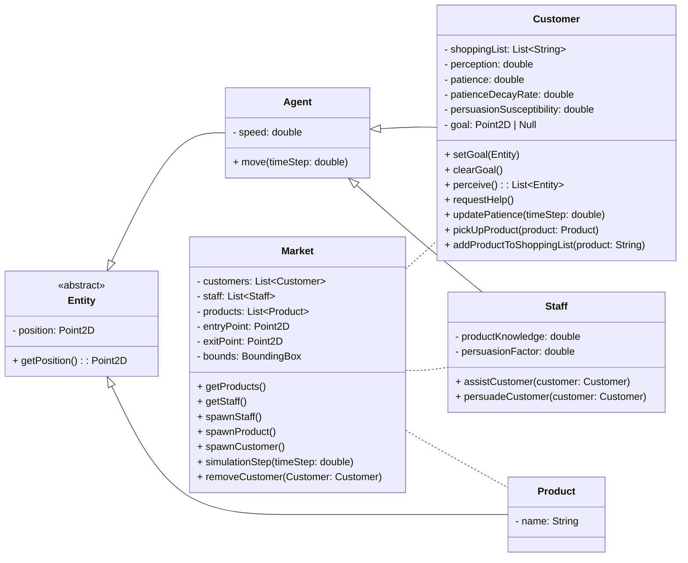
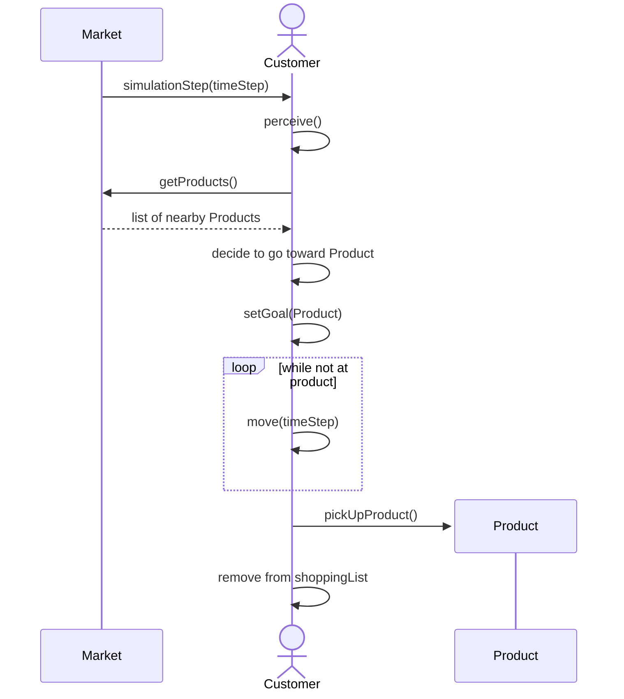
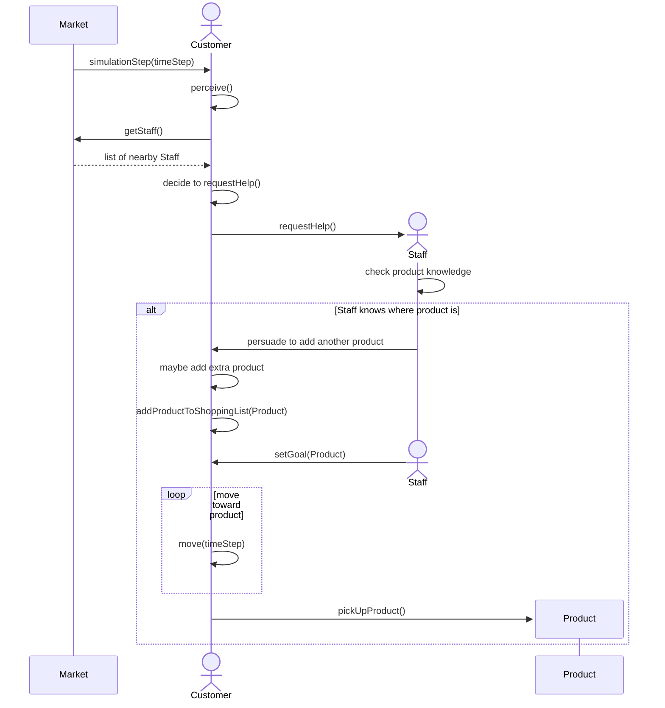
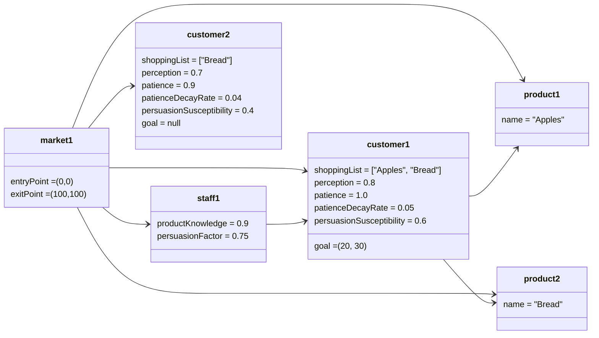
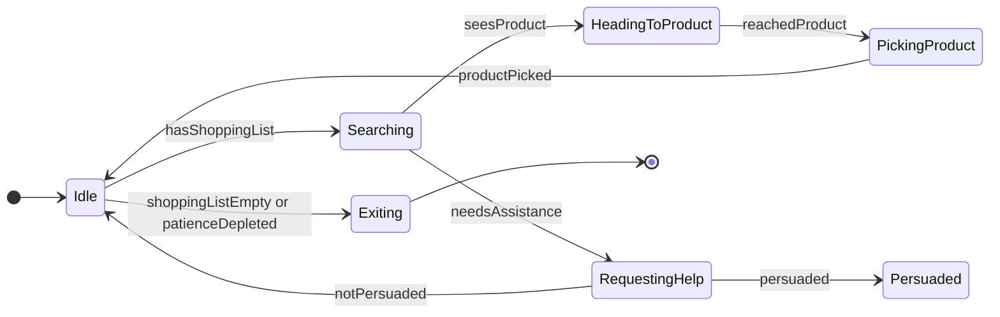

## Milestone 2
### Class diagrams

### Sequence diagrams
#### Customer finds product by itself

#### Customer requests help from staff

### Object diagram

### State Machine Diagrams
#### Customer State Machine Diagram

